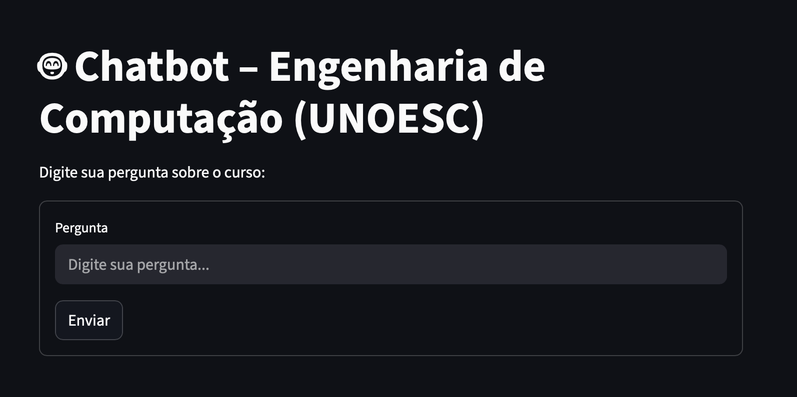

# 🤖 Chatbot – Engenharia de Computação (UNOESC)



| Agente conversacional utilizando Gemini, Flask, Streamlit, Scraper com Requests, e arquitetura completa em Docker.

| Este projeto consiste em um agente conversacional especializado no curso de Engenharia de Computação da UNOESC.

### 🔍 1. Scraper (Engenharia de Dados)
| Coleta automaticamente informações sobre o curso a partir de:
- Página oficial do curso
- APIs internas do site (ementas, disciplinas, professores)
- PPC em PDF
- Gera um arquivo base_conhecimento.md usado como fonte oficial das respostas.

### 🧠 2. Backend em Flask (Engenharia de IA)
| Responsável por:
- Carregar a base de conhecimento
- Montar o prompt para o Gemini
- Responder perguntas via API REST
- Endpoint principal: POST /ask

### 💻 3. Frontend com Streamlit (Interface)
| Aplicação web simples e intuitiva que permite:
- Enviar perguntas
- Exibir respostas
- Histórico do chat
- Loading e envio com Enter


# 🚀 Como Executar o Projeto
| Você pode rodar com Docker (recomendado) ou localmente.

## 🐳 1. Rodando com Docker (RECOMENDADO)
##### Executar a aplicação
```
docker-compose up --build
```

| Isso irá:
- Executar o scraper (apenas se a base não existir)
- Subir o backend em Flask → porta 4000
- Subir o frontend em Streamlit → porta 8501

##### Acessar a aplicação, abra no navegador em:
```
http://localhost:8501
```

## 🧪 2. Rodando Localmente (sem Docker)
##### Instalar dependências
```
sh install.sh
```

##### Iniciar Projetos
```
sh start.sh
```


# 📄 Licença
| Uso acadêmico e educacional.
| Sinta-se à vontade para expandir, melhorar e personalizar.
